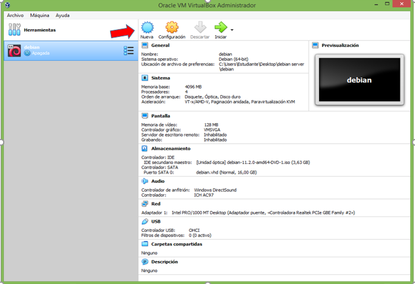
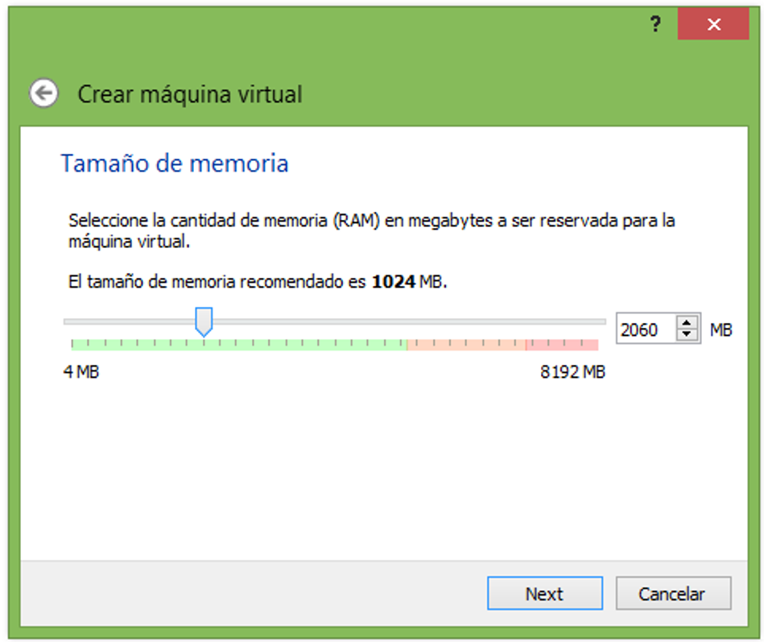
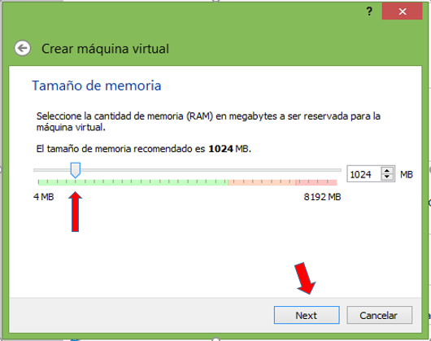
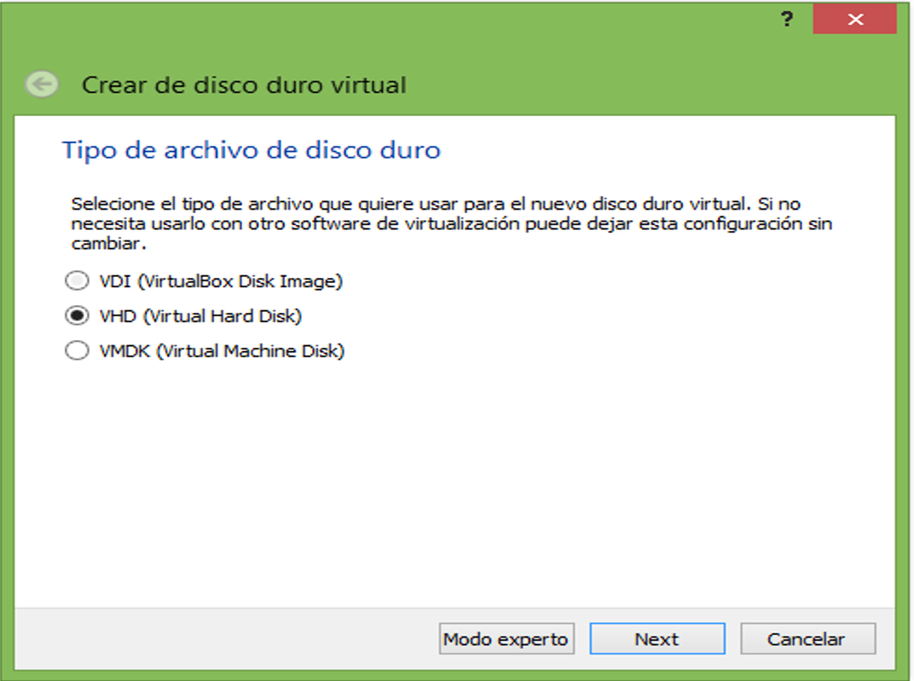
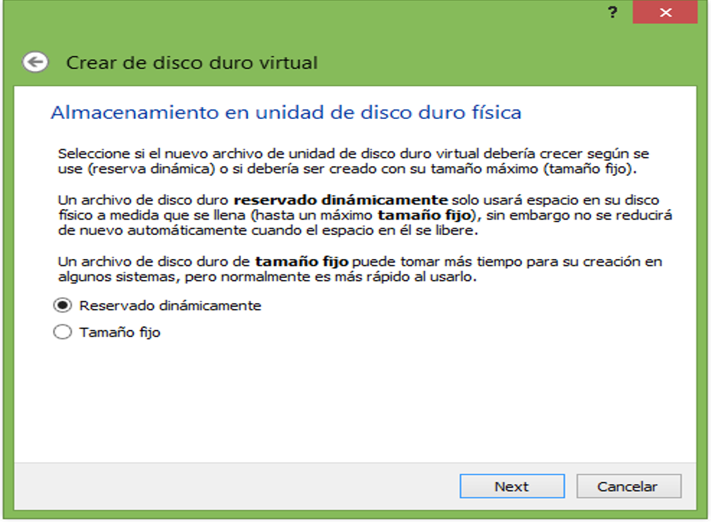
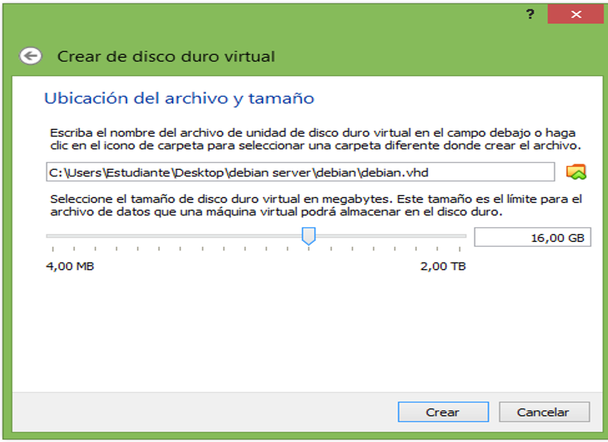
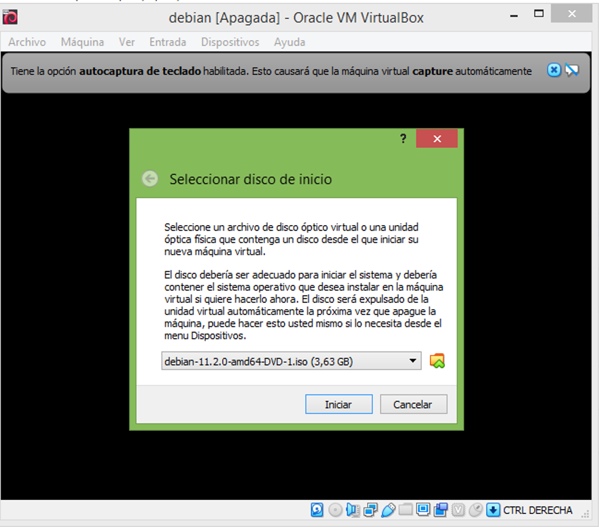
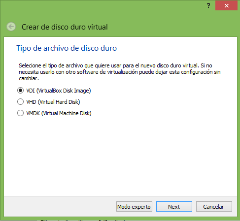

# linux_debian
Te ayudamos con la instalación de linux_debian 

1. Para crear una nueva máquina virtual en VirtualBox, hacemos clic en el botón Nuevo.

2. Asigne un nombre a su máquina virtual y luego seleccione Siguiente.

3. Para el tamaño de la memoria (RAM) utilizada en su máquina virtual es recomendado utilizar 1024 MB, luego le damos siguiente.

4. Después procedemos a crear un disco duro virtual para almacenar datos y archivos de nuestras máquinas virtuales. Elegir "Crear un disco duro virtual ahora" luego elige Crear.

