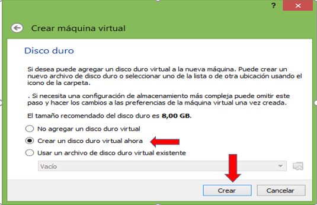
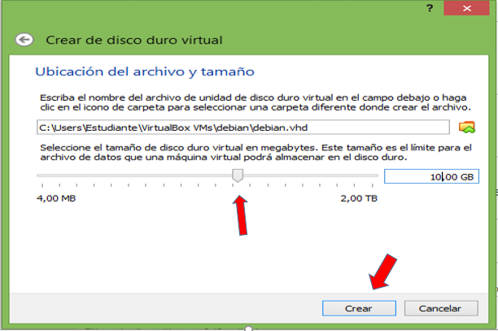
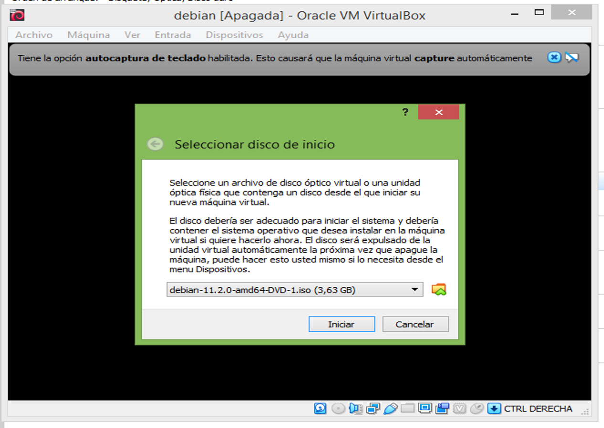
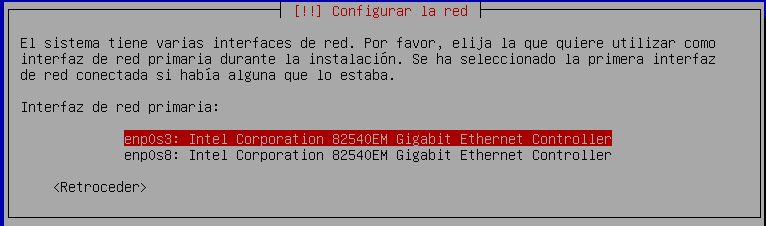
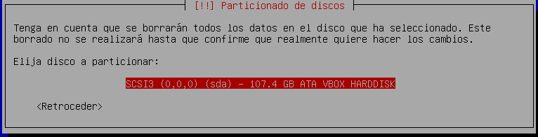
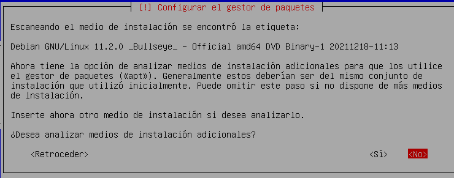

# linux_debian
Te ayudamos con la instalación de linux_debian 

1. Para crear una nueva máquina virtual en VirtualBox, hacemos clic en el botón Nuevo.

2. Asigne un nombre a su máquina virtual y luego seleccione Siguiente.

3. Para el tamaño de la memoria (RAM) utilizada en su máquina virtual es recomendado utilizar 1024 MB, luego le damos siguiente.

4. Después procedemos a crear un disco duro virtual para almacenar datos y archivos de nuestras máquinas virtuales. Elegir "Crear un disco duro virtual ahora" luego elige Crear.

5. Después de eso, elija VDI "Imagen de disco de VirtualBox".

6. Luego elija "asignado dinámicamente" luego elige Siguiente.

7. Para el tamaño del disco duro virtual utilizado, 10GB más que suficiente Después de eso elige Crear.

8. Seleccionamos el disco que contiene el sistema operativo que desea instalar.

9. Después de terminar de crear la máquina virtual, debemos hacer un pequeño ajuste. Seleccione la máquina virtual que creamos anteriormente (debian) y luego selecciónela Configuraciones para ingresar al menú de configuración.

10. verificamos que la configuracion de la maquina virtual cumpla con lo siguiente:

10.1. La memoria base del sistema sea 1024 MB.

10.2. El procesador este en 4.

10.3. En la aceleraciós el hardware de virtualizacion de habilitar las dos ópciones.

10.4. En la pantalla, la memoria de video debe estar en 128 MB.

10.5. En almacenamiento, el controlador IDE debe contener el disco.

10.6. por ultimo en la red, el adaptador 2 se habilita y debe estar conectado a la red interna.

11.

