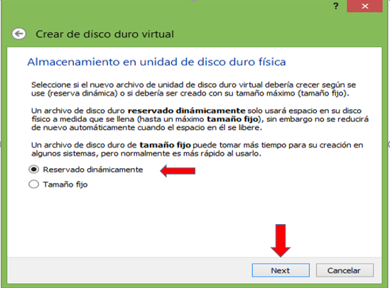

# linux_debian
Te ayudamos con la instalación de linux_debian 

1. Para crear una nueva máquina virtual en VirtualBox, hacemos clic en el botón Nuevo.

2. Asigne un nombre a su máquina virtual y luego seleccione Siguiente.

