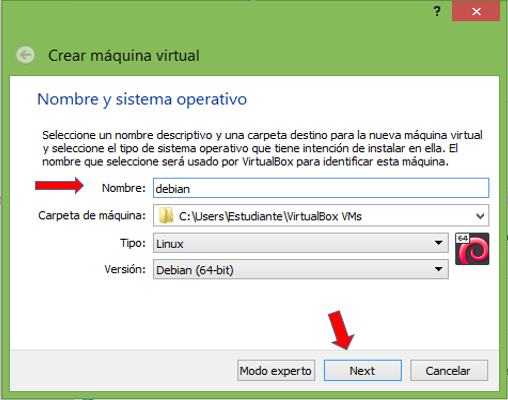
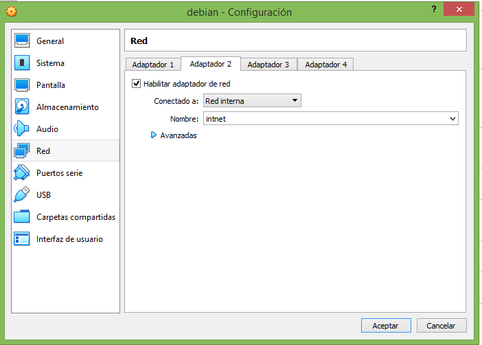

# linux_debian
Te ayudamos con la instalación de linux_debian 

1. Para crear una nueva máquina virtual en VirtualBox, hacemos clic en el botón Nuevo.

2. Asigne un nombre a su máquina virtual y luego seleccione Siguiente.

3. Para el tamaño de la memoria (RAM) utilizada en su máquina virtual es recomendado utilizar 1024 MB, luego le damos siguiente.

4. Después procedemos a crear un disco duro virtual para almacenar datos y archivos de nuestras máquinas virtuales. Elegir "Crear un disco duro virtual ahora" luego elige Crear.

6. Luego elija asignado dinámicamente luego elige Siguiente.

7. Para el tamaño del disco duro virtual utilizado, 10GB más que suficiente Después de eso elige Crear.

